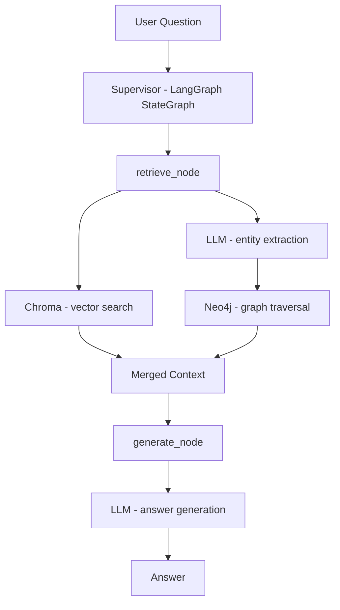

# Agentic Knowledge Web

> 從碎片到知識網：基於 GraphRAG 與 Multi-agent 的智能筆記系統

## Overview

傳統筆記工具（Notion、本地資料夾）面臨兩個核心問題：

- **知識孤島**：跨平台散落，筆記之間缺乏有意義的關聯。
- **缺乏智能引導**：只能查「已知」的關鍵字，無法回答「未知」的跨概念問題。

本專案目標是打造一個**自動化、具備記憶的個人知識助理**，結合 Multi-agent 框架與 GraphRAG，讓筆記從被動的資料儲存，進化為主動的推理夥伴。

## System Architecture



**技術棧：**

- **大腦層**：LangGraph + Multi-agent
- **記憶層**：Neo4j（知識圖譜，本地運行）+ Chroma（向量資料庫）
- **檢索**：GraphRAG 概念（Vector + Graph 雙引擎）
- **LLM**：Ollama (gemma4:31b-cloud 等模型)，Embedding 使用本地 Ollama 模型

## Quick Start

```bash
# 1. Clone the repo
git clone https://github.com/<your-username>/agentic-knowledge-web.git
cd agentic-knowledge-web

# 2. 安裝套件（使用 uv）
uv sync
# 或使用 pip
pip install -r requirements.txt

# 3. 設定環境變數
cp .env.example .env
# 填入 OLLAMA_API_KEY 以及本地 Neo4j 的帳號密碼（預設 neo4j/password）

# 4. 啟動依賴服務
# 請確保你的電腦已啟動：
# - 本地 Neo4j 服務 (例如 Neo4j Desktop)
# - 本地 Ollama 服務 (供 Embedding 使用)

# 5. 執行寫入流程
uv run src/scripts/ingest.py --input data/test_note.md

# 6. 執行查詢
uv run src/scripts/query.py --question "GraphRAG 和傳統 RAG 的差異是什麼？"

# 7. 執行查詢（Debug 模式，輸出中間結果）
uv run src/scripts/query.py --question "GraphRAG 是什麼？" --debug
```

## Project Structure

```
agentic-knowledge-web/
├── data/                        # 測試用 Markdown 筆記
├── frontend/                    # 前端介面（待開發）
├── src/
│   ├── agents/
│   │   ├── supervisor.py        # Supervisor Agent，判斷使用者意圖
│   │   └── retriever.py         # 查詢檢索 Agent
│   ├── database/
│   │   ├── neo4j_client.py      # Neo4j 圖形資料庫操作
│   │   └── chroma_client.py     # Chroma 向量資料庫操作
│   └── scripts/
│       ├── ingest.py            # 寫入流程（Chunking → Extraction → Loading）
│       ├── query.py             # 查詢入口
│       └── reset.py             # 重置資料庫工具
├── main.py                      # 主程式入口
├── .env.example
├── pyproject.toml
├── requirements.txt
└── README.md
```
