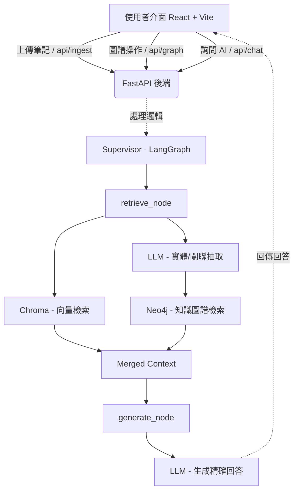

# Agentic Knowledge Web

> 從碎片到知識網：基於 GraphRAG 與 Multi-agent 的全端智能筆記與互動系統

## Overview

傳統筆記工具（Notion、本地資料夾）面臨兩個核心問題：

- **知識孤島**：跨平台散落，筆記之間缺乏有意義的關聯。
- **缺乏智能引導**：只能查「已知」的關鍵字，無法回答「未知」的跨概念問題。

本專案目標是打造一個**自動化、具備視覺化互動介面的個人知識助理**，結合 Multi-agent 框架與 GraphRAG，並透過 React 力導向圖譜（Force-Directed Graph）呈現，讓筆記從被動的資料儲存，進化為主動的推理夥伴與視覺化地圖。

## System Architecture



**技術棧：**

- **前端介面**：React 19, Vite, Tailwind CSS v3, Zustand, react-force-graph-2d, react-resizable-panels
- **後端 API**：FastAPI
- **大腦層**：LangGraph + Multi-agent
- **記憶層**：Neo4j（知識圖譜，本地運行）+ Chroma（向量資料庫，本地持久化）
- **RAG 檢索**：GraphRAG 概念（Vector + Graph 雙引擎）
- **LLM**：Ollama (gemma4:31b-cloud 等模型)，Embedding 使用本地 Ollama 模型 (nomic-embed-text)

## Quick Start

```bash
# 1. 取得專案原始碼
git clone https://github.com/<your-username>/agentic-knowledge-web.git
cd agentic-knowledge-web

# 2. 安裝後端 Python 套件（使用 uv）
uv sync

# 3. 設定環境變數
cp .env.example .env
# 填入 OLLAMA_API_KEY 以及本地 Neo4j 的連線設定（預設 user: neo4j, password: password）

# 4. 啟動依賴服務
# 確保你的工作環境已啟動以下兩項本地服務：
# - Neo4j 服務 (例如 Neo4j Desktop 或 Docker)
# - Ollama 服務 (需預先 run 或是 pull 相關模型)

# 5. 啟動後端 API 伺服器
uv run python -m uvicorn main:app --reload
# 伺服器將運行在 http://127.0.0.1:8000

# 6. 啟動前端開發伺服器（請另開一個終端機）
cd frontend
npm install
npm run dev
# 前端介面將運行在 http://localhost:5173
```

> **操作說明**：
> - **上傳文件**：支援 `.md`、`.txt`、`.pdf`、`.docx` 格式，拖拽或點擊上傳後系統自動進行向量寫入及知識圖譜實體抽取。
> - **圖譜互動**：左鍵點擊選取節點，右鍵展開鄰居節點，拖拽固定節點位置。
> - **AI 問答**：點擊節點的「詢問 AI」按鈕可針對特定概念提問，或直接在聊天室輸入問題。
> - **筆記瀏覽**：切換到「筆記庫」分頁可瀏覽已上傳文件，Markdown 渲染、PDF 嵌入預覽均支援。
> - **主題切換**：右上角按鈕可在淺色 / 深色主題間切換，設定自動記憶。

## Project Structure

```
agentic-knowledge-web/
├── frontend/                    # Vite + React 前端專案
│   ├── src/
│   │   ├── components/          # 視覺圖譜、對話視窗、節點資訊等 UI 元件
│   │   ├── store/               # Zustand 全域狀態管理（含主題切換）
│   │   └── lib/                 # axios API 呼叫封裝
│   └── package.json
├── src/
│   ├── api/                     # FastAPI Router 層 (chat, graph, ingest, reset, documents)
│   ├── agents/                  # LangGraph Supervisor 與 Retriever Agents
│   ├── database/                # Neo4j 客戶端 (含圖譜檢索邏輯) 與 Chroma 客戶端
│   └── scripts/                 # CLI 與共用設定 (llm.py, ingest.py)
├── main.py                      # FastAPI 主程式入口點
├── pyproject.toml               # 專案 Python 依賴管理 (Hatchling)
├── .env.example                 # 環境變數範例
└── README.md
```

## Features

- **✅ 多格式文件支援**：`.md`、`.txt`、`.pdf`、`.docx` 均可上傳，自動進行向量嵌入與知識圖譜抽取。
- **✅ 雙引擎混合檢索**：結合 Chroma 的語義相似度與 Neo4j 的知識圖譜邏輯關聯，減少大模型幻覺。
- **✅ 力導向圖譜互動化**：透過 `react-force-graph` 高效渲染節點，物理模擬優化避免初始爆炸，支援右鍵動態展開關聯網路。
- **✅ 可調整版面**：左右面板（圖譜 / 控制）與上下面板（對話 / 節點資訊）均支援拖拽調整大小。
- **✅ Markdown 渲染**：AI 回覆與 Markdown 筆記均以完整格式渲染，包含標題、列表、程式碼區塊。
- **✅ 多格式文件瀏覽**：筆記庫支援 Markdown 渲染、PDF 嵌入預覽、DOCX / TXT 純文字顯示。
- **✅ 深/淺主題切換**：右上角一鍵切換，設定記憶於 localStorage。
- **✅ 容錯機制**：Embedding 異常時自動降級為純圖譜檢索，ingestion 進度即時串流顯示。
